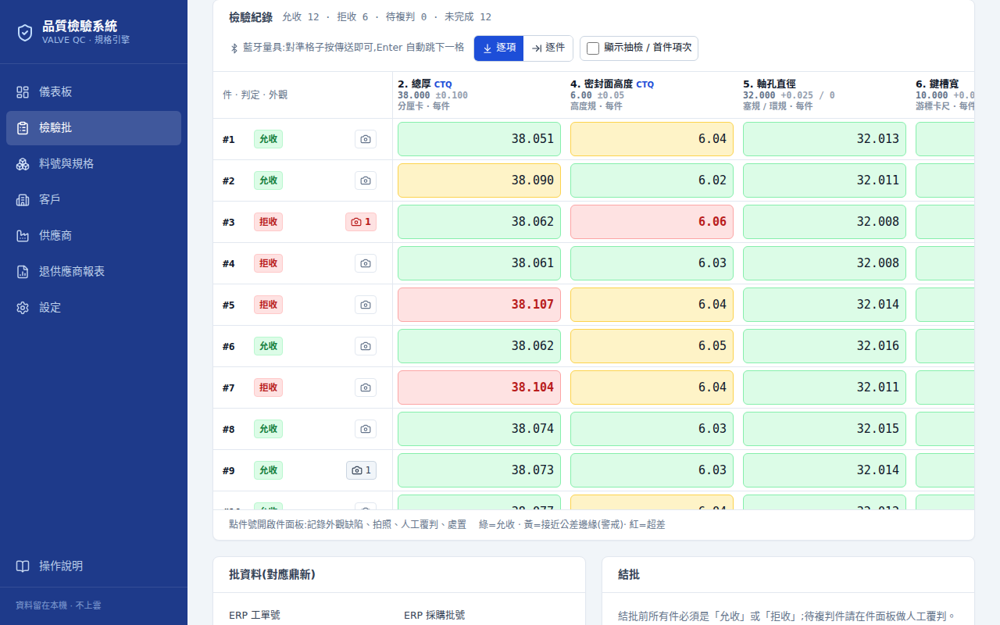
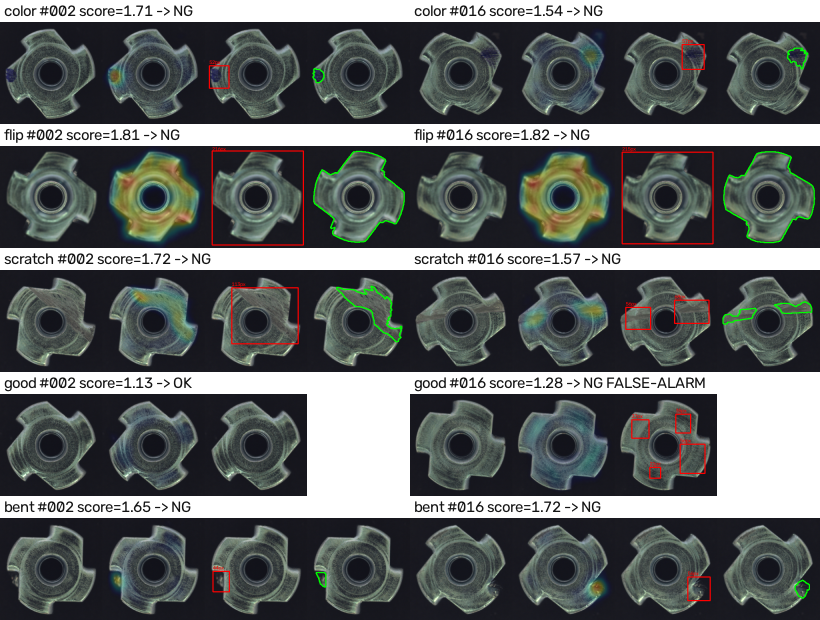

# 閥門零件 AI 檢驗與製程優化專案

代工廠圓形閥門鑄件(3"~14")的品質檢驗數位化、外觀 AI 檢測、與製程數據分析。

> 狀態(2026-09-11):**第 0 期檢驗系統已可用、第 1 期 AI 檢測 pipeline 已驗證並接通。** 下一閘門 = 自家零件照片。

## 一句話

**先數位化,再分析,最後才是視覺 AI。** 第一個做出來的工具是「規格引擎 + 檢驗紀錄」,它是後面所有 AI 應用的地基。AI 負責「看」,規則負責「判」,人負責「確認例外」。

## 給第一次看的人

| 你是 | 先看 |
|---|---|
| 檢驗員 / 品管 | [操作說明(含截圖,以一批真實流程為例)](manual/) · [**系統展示版(唯讀,可點)**](demo/) |
| 老闆 / 決策者 | [06 決策記錄](06-decisions.md) → [03 分期路線圖](03-roadmap.md) → [09 AI 驗證結果](09-aoi-poc-results.md) |
| 工程 / 合作夥伴 | [02 系統架構](02-architecture.md) → [07 檢驗表與允收標準](07-inspection-forms.md) → [程式碼](https://github.com/all3718si2709-beep/Wang) |

## 文件

| 文件 | 內容 |
|---|---|
| [01 現況與需求](01-problem-and-context.md) | 零件、缺陷、量具、產線條件 |
| [02 系統架構](02-architecture.md) | 三層:規格引擎 / 尺寸整合 / 外觀 AOI |
| [03 分期路線圖](03-roadmap.md) | 現在~3個月 / 3~6 / 6~12 / 1年+,每期有閘門 |
| [04 AI 製程優化地圖](04-ai-process-map.md) | 從進料到出貨,AI 能幫哪裡、不能幫哪裡 |
| [05 待確認事項](05-open-questions.md) | 還開著的問題與目前假設 |
| [06 決策記錄](06-decisions.md) | D1~D13 已拍板的判斷與理由 |
| [07 檢驗表與允收標準](07-inspection-forms.md) | 業界標準版(MSS SP-55、PPAP 版面) |
| [08 檢驗作業 SOP](08-sop.md) | 建檔 → 每批 → 每月 |
| [09 AOI 離線驗證結果](09-aoi-poc-results.md) | 公開金屬件資料集上漏檢 0/93、誤殺 1/22 |
| [操作說明](manual/) | 系統怎麼用,含 20 張實際畫面 |
| [系統展示版](demo/) | 檢驗系統每一頁的靜態快照(儀表板 / 批 / 件面板 / 規格 / 報告 / 退貨報表),可互相點,不能輸入 |

## 系統長什麼樣

*量測表格:Enter 自動跳格、藍牙量具直打、即時 OK / 警戒 / NG;整欄變黃 = 刀具磨耗前兆。*

*AI 外觀檢測(公開金屬圓件資料集驗證):原圖 → 異常熱圖 → 偵測框 → 標準答案。只用 OK 件訓練,漏檢 0/93。*

## 程式碼

- [`qc-app/`](https://github.com/all3718si2709-beep/Wang/tree/main/qc-app) — 檢驗系統(Next.js + SQLite,單機,資料留廠內),安裝四行指令
- [`aoi/`](https://github.com/all3718si2709-beep/Wang/tree/main/aoi) — AI 外觀檢測(PatchCore),含拍照規範

> 這個網站是專案說明與文件。[展示版](demo/) 是系統畫面的靜態快照(假資料、唯讀);檢驗系統本體需要伺服器與資料庫,安裝在廠內電腦執行。
